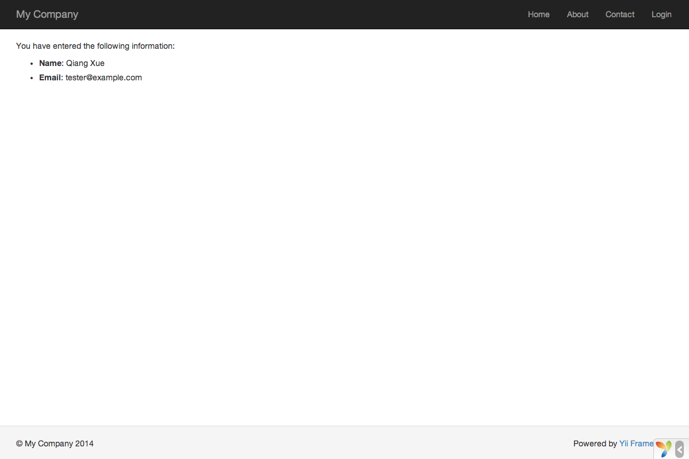

使用表单
==================

本小节将介绍如何创建一个从用户那搜集数据的表单页面。该页将显示一个包含 name 输入框和 email 输入框的表单。当搜集完这两部分信息后，页面将会输出登记信息的确认。

为了实现这个目标，除了创建一个[操作](structure-controllers.md)和两个[视图](structure-views)外，你还需要创建一个[模型](structure-models.md)。

贯穿整个小节，你将会学到：

* 创建一个[模型](structure-models.md)表示用户通过表单输入的数据
* 声明规则去验证输入的数据
* 在[视图](structure-views.md)中生成一个 HTML 表单


创建模型 <a name="creating-model"></a>
----------------

模型类 `EntryForm` 代表从用户那请求的数据，该类如下所示并存储在 `models/EntryForm.php` 文件中。请参考[类自动加载](concept-autoloading.md)小节获取更多关于类命名约定的介绍。

```php
<?php

namespace app\models;

use yii\base\Model;

class EntryForm extends Model
{
    public $name;
    public $email;

    public function rules()
    {
        return [
            [['name', 'email'], 'required'],
            ['email', 'email'],
        ];
    }
}
```

该类继承自 [[yii\base\Model]]，Yii 提供的一个基类，通常用来表示数据。

> 补充：[[yii\base\Model]] 被用于普通模型类的父类并与数据表**无关**。[[yii\db\ActiveRecord]] 通常是普通模型类的父类但与数据表有关联（译者注：[[yii\db\ActiveRecord]] 类其实也是继承自 [[yii\base\Model]] 但增加了数据库处理）。

`EntryForm` 类包含 `name` 和 `email` 两个公共成员，用来储存用户输入的数据。它还包含一个名为 `rules()` 的方法，用来返回数据验证规则的集合。上面声明的验证规则表示：

* `name` 和 `email` 值都是必须的
* `mail` 的值必须满足 email 地址验证

如果你有一个从用户那搜集了数据的 `EntryForm` 对象，你可以调用它的 [[yii\base\Model::validate()|validate()]] 方法触发数据验证。如果有数据验证失败，将把 [[yii\base\Model::hasErrors|hasErrors]] 属性设为 ture，想要知道具体发生什么错误就调用 [[yii\base\Model::getErrors|getErrors]]。

```php
<?php
$model = new EntryForm();
$model->name = 'Qiang';
$model->email = 'bad';
if ($model->validate()) {
    // 验证成功！
} else {
    // 失败！
    // 使用 $model->getErrors() 获取错误详情
}
```


创建操作 <a name="creating-action"></a>
------------------

下面你得在 `site` 控制器中创建一个 `entry` 操作用于新建的模型。操作的创建和使用已经在[说一声你好](start-hello.md)小节中解释了。

```php
<?php

namespace app\controllers;

use Yii;
use yii\web\Controller;
use app\models\EntryForm;

class SiteController extends Controller
{
    // ...其它代码...

    public function actionEntry()
    {
        $model = new EntryForm;

        if ($model->load(Yii::$app->request->post()) && $model->validate()) {
            // 验证 $model 收到的数据

            // 做些有意义的事 ...

            return $this->render('entry-confirm', ['model' => $model]);
        } else {
            // 无论是初始化显示还是数据验证错误
            return $this->render('entry', ['model' => $model]);
        }
    }
}
```

该操作首先创建了一个 `EntryForm` 对象。然后尝试从 `$_POST` 搜集用户提交的数据，由 Yii 的 [[yii\web\Request::post()]] 方法负责。如果模型被成功填充数据（也就是说用户已经提交了 HTML 表单），操作将调用 [[yii\base\Model::validate()|validate()]] 去确保用户提交的是有效数据。

> 补充：表达式 `Yii::$app` 代表[应用](structure-applications.md)实例，它是一个全局可访问的单例。同时它也是一个[服务定位器](concept-service-locator.md)，能提供 `request`，`response`，`db` 等等特定功能的组件。在上面的代码里就是使用 `request` 组件来访问应用实例收到的 `$_POST` 数据。

用户提交表单后，操作将会渲染一个名为 `entry-confirm` 的视图去确认用户输入的数据。如果没填表单就提交，或数据包含错误（译者：如 email 格式不对），`entry` 视图将会渲染输出，连同表单一起输出的还有验证错误的信息。

> 注意：在这个简单例子里我们只是呈现了有效数据的确认页面。实践中你应该考虑使用 [[yii\web\Controller::refresh()|refresh()]] 或 [[yii\web\Controller::redirect()|redirect()]] 去避免[表单重复提交问题](http://en.wikipedia.org/wiki/Post/Redirect/Get)。


创建视图 <a name="creating-views"></a>
--------------

最后创建两个视图文件 `entry-confirm` 和 `entry`。他们将被刚才创建的 `entry` 操作渲染。

`entry-confirm` 视图简单地显示 name 和 email 数据。视图文件保存在 `views/site/entry-confirm.php`。

```php
<?php
use yii\helpers\Html;
?>
<p>You have entered the following information:</p>

<ul>
    <li><label>Name</label>: <?= Html::encode($model->name) ?></li>
    <li><label>Email</label>: <?= Html::encode($model->email) ?></li>
</ul>
```

`entry` 视图显示一个 HTML 表单。视图文件保存在 `views/site/entry.php`。

```php
<?php
use yii\helpers\Html;
use yii\widgets\ActiveForm;
?>
<?php $form = ActiveForm::begin(); ?>

    <?= $form->field($model, 'name') ?>

    <?= $form->field($model, 'email') ?>

    <div class="form-group">
        <?= Html::submitButton('Submit', ['class' => 'btn btn-primary']) ?>
    </div>

<?php ActiveForm::end(); ?>
```

The view uses a powerful [widget](structure-widgets.md) called [[yii\widgets\ActiveForm|ActiveForm]] to
build the HTML form. The `begin()` and `end()` methods of the widget render the opening and closing
form tags, respectively. Between the two method calls, input fields are created by the
[[yii\widgets\ActiveForm::field()|field()]] method. The first input field is for the "name" data,
and the second for the "email" data. After the input fields, the [[yii\helpers\Html::submitButton()]] method
is called to generate a submit button.


Trying it Out <a name="trying-it-out"></a>
-------------

To see how it works, use your browser to access the following URL:

```
http://hostname/index.php?r=site/entry
```

You will see a page displaying a form with two input fields. In front of each input field, a label indicates what data is to be entered. If you click the submit button without
entering anything, or if you do not provide a valid email address, you will see an error message displayed next to each problematic input field.


After entering a valid name and email address and clicking the submit button, you will see a new page
displaying the data that you just entered.




### Magic Explained <a name="magic-explained"></a>

You may wonder how the HTML form works behind the scene, because it seems almost magical that it can
display a label for each input field and show error messages if you do not enter the data correctly
without reloading the page.

Yes, the data validation is initially done on the client side using JavaScript, and secondarily performed on the server side via PHP.
[[yii\widgets\ActiveForm]] is smart enough to extract the validation rules that you have declared in `EntryForm`,
turn them into executable JavaScript code, and use the JavaScript to perform data validation. In case you have disabled
JavaScript on your browser, the validation will still be performed on the server side, as shown in
the `actionEntry()` method. This ensures data validity in all circumstances.

> Warning: Client-side validation is a convenience that provides for a better user experience. Server-side validation
  is always required, whether or not client-side validation is in place.

The labels for input fields are generated by the `field()` method, using the property names from the model.
For example, the label `Name` will be generated for the `name` property. 

You may customize a label within a view using 
the following code:

```php
<?= $form->field($model, 'name')->label('Your Name') ?>
<?= $form->field($model, 'email')->label('Your Email') ?>
```

> Info: Yii provides many such widgets to help you quickly build complex and dynamic views.
  As you will learn later, writing a new widget is also extremely easy. You may want to turn much of your
  view code into reusable widgets to simplify view development in future.


Summary <a name="summary"></a>
-------

In this section of the guide, you have touched every part in the MVC design pattern. You have learned how
to create a model class to represent the user data and validate said data.

You have also learned how to get data from users and how to display data back in the browser. This is a task that
could take you a lot of time when developing an application, but Yii provides powerful widgets
to make this task very easy.

In the next section, you will learn how to work with databases, which are needed in nearly every application.
