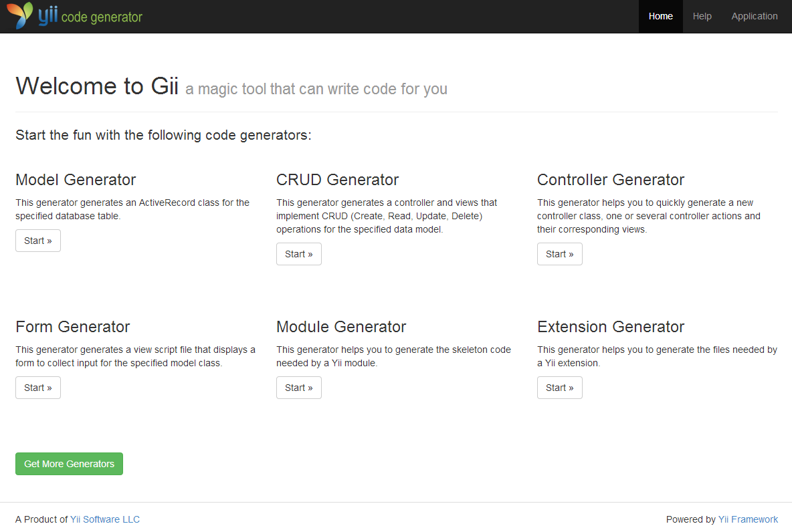

Gii 代码生成器
============================

Yii 包含一个非常便利的工具，名字叫做 Gii，它提供了一个通过生成通常被使用的代码片段以及完整的CRUD（Create，Read，Update，Delete的缩写，也就是咱华人常说的增删改查）控制器的方式，实现了快速生成应用原型的目的
。


安装和配置
--------------------------

Gii 是个官方的 Yii 扩展，建议通过
[Composer（英文下载页面）](http://getcomposer.org/download/) 来安装这个扩展。

你可以要么通过如下命令：

```
php composer.phar require --prefer-dist yiisoft/yii2-gii "*"
```

或者在你的 `composer.json` 文件的 require 部分添加如下代码：

```
"yiisoft/yii2-gii": "*"
```

一旦 Gii 扩展被正确安装，你可以通过在应用配置文件中添加下面这块代码来启用它：

```php
'modules' => [
	'gii' => [
		'class' => 'yii\gii\Module',
	],
]
```

这之后，你就可以通过如下URL访问Gii：

```
http://localhost/path/to/index.php?r=gii
```

> 注意：如果你通过不是本地 localhost 的 IP 地址访问gii，默认状态下，那这个访问会被拒绝。如果要规避这条默认的规则，你需要在配置中，添加其他被允许的 IP 地址到如下位置：
>
```php
'gii' => [
	'class' => 'yii\gii\Module',
	'allowedIPs' => ['127.0.0.1', '::1', '192.168.0.*', '192.168.178.20'] // 把这行改为你所需的
],
```

### 基本应用模版

在基本应用模版中，配置架构略显不同，所以Gii应该被配置在
`config/web.php`文件中：

```php
// ...
if (YII_ENV_DEV)
{
	// 针对‘dev’（开发）环境的配置调整。
	$config['preload'][] = 'debug';
	$config['modules']['debug'] = 'yii\debug\Module';
	$config['modules']['gii'] = 'yii\gii\Module'; // <--- 这儿
}
```

这样，你需要这样来调整 IP 地址：

```php
if (YII_ENV_DEV)
{
	// 针对‘dev’（开发）环境的配置调整。
	$config['preload'][] = 'debug';
	$config['modules']['debug'] = 'yii\debug\Module';
	$config['modules']['gii'] = [
		'class' => 'yii\gii\Module',
		'allowedIPs' => ['127.0.0.1', '::1', '192.168.0.*', '192.168.178.20'],
	];
}
```

如何使用
-------------

当你打开 Gii 时，你首先会看到这样一个入口页面，来让我们选择所需的生成器（generator）。



默认有如下的生成器可供选择：

- **Model Generator（模型生成器）** - 这个生成器用于基于特定的数据表生成相对应的ActiveRecord（活动记录）类。
- **CRUD Generator（增删改查生成器）** - 这个生成器会生成一个控制器（Controller）与一系列视图（View）
  以提供对某个数据模型基本的增删改查的操作。
- **Controller Generator（控制器生成器）** - 这个生成器可以帮你快速生成一个全新的控制器类，包括一个或多个
  控制器的动作，与这些动作相对应的视图。
- **Form Generator（表单生成器）** - 这个生成器生成一个视图脚本文件，显示一个表单用以
  收集针对某个模型类的用户输入
- **Module Generator（子模块生成器）** - 这个生成器帮你生成一个Yii 子模块所需的代码骨架。

选择一个生成器通过单击"开始"按钮你会看到表单，
它允许您配置生成器的参数。根据您的需要填写完表单，然后按"Preview"（预览）按钮以获取
一个 Gii 马上会生成的代码的一个预览。根据你所选择的生成器和这些文件是否已经存在的不同，
你会看到一个好像下面这个图片所示那样的返回结果：


点击文件名，你会看到即将被生成的这个文件的代码预览。
若文件已经存在，gii 同样会提供一个 diff （英文difference的简写）视图显示了已存在的文件和即将生成的文件的代码对比。
这种状况下，你就可以很方便地选择那些文件会被覆盖，而哪些不会。

> 小技巧：当在数据库被修改之后使用Model Generator重新生成模型的时候，你可以从 Gii 的预览中复制那些代码，
  并把这些改变与你已有的代码融合。你可以用 IDE 的一些功能来实现这一点，比如PHPStorms所提供的
  [compare with clipboard（英文，与剪贴板作对比）](http://www.jetbrains.com/phpstorm/webhelp/comparing-files.html)。
  他可以帮助你把相关修改合并起来，并把那些可能回滚你原来代码的那些改变跳过。（译者注：相比较PHPStorm强大的功能，其个人许可的费用算是很便宜了。靠PHP吃饭的各位有条件的话应该入正）

你一讲审查完这些代码了之后，你可以选择需要生产的文件，然后点击 "Generate" 按钮以创建这些文件。
如果一切正常，那么就结束了。如果你看到有错误，提示说gii不能生成那些文件（ gii is not able to generate the files），
则你只能自己去检查下服务器是否有目录的写权限。

> 注意：Gii生成的代码只是一个模版而已，你需要自行修改以满足你的需求。
  他只能帮你加速创建新东西的速度，但他不是直接拿来即用的产物。
  我们经常看到一些开发者，把 gii生成的模型不加修改，只是简单继承了一下，
  然后在继承类里扩展某些功能。这并不是他被设计的初衷。被 Gii 生成的代码可能并不完整或并不正确
  并且必须要在使用之前，经过修改，才能符合你的要求。


创建你自己的模版
---------------------------

每一个生成器都有一个文本框，允许你自己选择用以生成代码的模版。
Gii 默认只提供一套模版，但是你可以创建你自己的模版来调整成你需要的样子。

待定...


创建你自己的生成器
----------------------------

待定...
